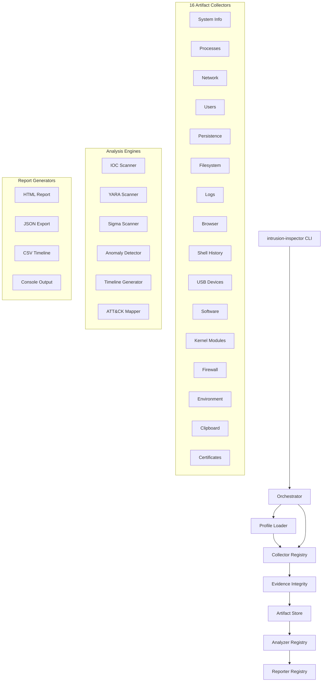

# IntrusionInspector

Cross-platform DFIR artifact collection, analysis, and triage tool for corporate endpoint incident response. Inspired by Mandiant Redline and Plaso/log2timeline.

## Architecture



## Quick Start

```bash
# Install uv (if not installed)
curl -LsSf https://astral.sh/uv/install.sh | sh

# Clone and install
git clone <repo-url> && cd IntrusionInspector
just sync

# Full triage (collect + analyze + report)
sudo intrusion-inspector triage --output ./case_001/ --case-id "IR-2025-042" --examiner "K. Gaston"

# Quick triage (processes, network, users only)
sudo intrusion-inspector triage --output ./case_001/ --profile quick

# With IOC/Sigma/YARA rules
sudo intrusion-inspector triage --output ./case_001/ \
    --iocs rules/iocs/ --sigma rules/sigma/ --yara rules/yara/

# Encrypted evidence package for transport
sudo intrusion-inspector triage --output ./case_001/ --secure-output --password "CaseKey"

# Verify evidence integrity
intrusion-inspector verify --input ./case_001/
```

## CLI Commands

| Command | Description |
|---------|-------------|
| `triage` | Full pipeline: collect + analyze + report |
| `collect` | Collect artifacts only |
| `analyze` | Analyze previously collected artifacts |
| `report` | Generate reports from analysis results |
| `verify` | Verify evidence integrity against manifest |

### Key Flags

| Flag | Commands | Description |
|------|----------|-------------|
| `--output, -o` | triage, collect | Output directory |
| `--profile, -p` | triage, collect | Collection profile: `quick`, `standard`, `full` |
| `--case-id` | triage, collect | Case identifier for chain of custody |
| `--examiner` | triage, collect | Examiner name for chain of custody |
| `--iocs` | triage, analyze | IOC rules path |
| `--sigma` | triage, analyze | Sigma rules path |
| `--yara` | triage, analyze | YARA rules path |
| `--secure-output` | triage | Encrypt evidence package (AES-256) |
| `--password` | triage | Password for encrypted package |
| `--format, -f` | triage, report | Report format: `html`, `json`, `csv`, `console` |
| `--verbose, -v` | all | Enable debug logging |

## Collection Profiles

| Profile | Collectors | File Hashing | YARA | Typical Duration |
|---------|-----------|--------------|------|------------------|
| `quick` | 5 (system, processes, network, users, persistence) | No | No | ~30 seconds |
| `standard` | 16 (all) | No | No | ~2 minutes |
| `full` | 16 (all) | Yes | Yes | ~5 minutes |

## Collectors

| Collector | Windows | Linux | macOS | Artifacts |
|-----------|---------|-------|-------|-----------|
| System Info | WMI, registry | /proc, uname | sysctl, sw_vers | Hostname, OS, IPs, domain |
| Processes | psutil + WMI | psutil + /proc | psutil | PID, cmdline, parent, hashes |
| Network | psutil, netstat | psutil, /proc/net | psutil, lsof | Connections, DNS, ARP |
| Users | net user, SAM | /etc/passwd, utmp | dscl, utmpx | Accounts, logins |
| Persistence | schtasks, services, Run keys | cron, systemd | launchd, cron | Autostart mechanisms |
| Filesystem | Prefetch, Recent, Temp | /tmp, /var/tmp, /dev/shm | /tmp, recent items | Suspicious files |
| Logs | Event Logs (evtx) | syslog, auth.log, journal | system.log | Security logs |
| Browser | Chrome, Edge, Firefox | Chrome, Firefox | Chrome, Firefox, Safari | History, downloads |
| Shell History | PowerShell | bash, zsh, fish | zsh, bash | Command history |
| USB Devices | Registry, setupapi | syslog, lsusb | system_profiler | Device history |
| Software | Registry, WMI | dpkg, rpm, snap | system_profiler, brew | Installed apps |
| Kernel Modules | driverquery | lsmod, /proc/modules | kextstat | Loaded modules |
| Firewall | netsh advfirewall | iptables, nftables, ufw | pfctl | Firewall rules |
| Environment | Registry, env | /proc/*/environ | env, launchctl | Environment variables |
| Clipboard | PowerShell | xclip, xsel, wl-paste | pbpaste | Clipboard contents |
| Certificates | certutil | /etc/ssl, openssl | security, Keychain | Certificate stores |

## Analyzers

| Analyzer | Description | Detection Method |
|----------|-------------|-----------------|
| IOC Scanner | Matches artifacts against YAML-defined indicators | Hash, IP, domain, filepath, process name matching |
| YARA Scanner | Runs YARA rules against collected files | Pattern matching (optional, requires yara-python) |
| Sigma Scanner | Evaluates Sigma detection rules against logs | Field-based log analysis |
| Anomaly Detector | Heuristic checks with MITRE ATT&CK mapping | LOLBins, parent-child, temp execution, etc. |
| Timeline Generator | Plaso-style super timeline from all collectors | Timestamp aggregation and sorting |
| MITRE ATT&CK Mapper | Aggregates technique IDs, generates Navigator layer | Cross-analyzer technique correlation |

## MITRE ATT&CK Coverage

The anomaly detector maps findings to ATT&CK techniques:

| Check | Techniques |
|-------|-----------|
| LOLBins usage | T1218, T1216 |
| Unusual parent-child processes | T1055, T1036 |
| Temp directory execution | T1204 |
| Suspicious scheduled tasks | T1053 |
| Unusual network connections | T1071 |
| Base64-encoded commands | T1027, T1059 |
| Unusual services | T1543 |
| PATH hijacking | T1574 |
| Rogue certificates | T1553 |
| Suspicious kernel modules | T1547, T1014 |
| Clipboard monitoring | T1115 |
| Firewall tampering | T1562 |

## Evidence Integrity

Every collection produces:
- `manifest.json` — SHA256 hash of every collected file
- `audit.log` — Timestamped log of every action taken
- `chain_of_custody.json` — Case ID, examiner, system IDs, timestamps, tool version
- `--secure-output` — AES-256 encrypted ZIP for safe transport

Verify integrity: `intrusion-inspector verify --input ./case_001/`

## Output Structure

```
case_001/
├── raw/                        # Raw collector output (JSON per collector)
│   ├── system_info.json
│   ├── processes.json
│   ├── network.json
│   └── ...
├── analysis/                   # Analysis results
│   ├── anomaly_detector.json
│   ├── timeline.json
│   ├── ioc_scanner.json
│   └── mitre_attack_summary.json
├── report.html                 # Full HTML report with ATT&CK matrix
├── report.json                 # JSON export for SIEM ingestion
├── timeline.csv                # CSV super timeline
├── findings.csv                # CSV findings export
├── attack_navigator_layer.json # ATT&CK Navigator layer
├── manifest.json               # Evidence integrity manifest
├── audit.log                   # Collection audit log
└── chain_of_custody.json       # Chain of custody metadata
```

## Project Structure

```
IntrusionInspector/
├── pyproject.toml              # Root uv workspace
├── justfile                    # Dev commands
├── profiles/                   # Collection profile YAML
├── rules/                      # Detection rules (IOC, YARA, Sigma)
├── development/                # Dev tooling configs
├── .github/                    # GitHub templates
└── app/                        # Python packages (uv workspace members)
    ├── settings/               # Shared config constants
    ├── logger/                 # Structured logging
    ├── errors/                 # Error hierarchy
    ├── utils/                  # Forensic utilities
    ├── collectors/             # 16 artifact collectors
    ├── analyzers/              # 6 analysis engines
    ├── reporters/              # 4 report generators
    ├── evidence/               # Evidence integrity + secure output
    ├── engine/                 # Orchestration engine
    └── cli/                    # Click CLI entry point
```

## Development

```bash
just sync              # Install all packages
just test              # Run all tests
just test collectors   # Run tests for one package
just test-cov          # Run with coverage
just lint              # Pylint across all packages
just pre-commit        # Pre-commit hooks
```

## Tech Stack

| Component | Technology |
|-----------|-----------|
| Language | Python 3.12+ |
| Build | Hatchling |
| Package Manager | uv (workspace) |
| Task Runner | just |
| CLI | Click |
| Console Output | Rich |
| HTML Reports | Jinja2 |
| Process/System Data | psutil |
| IOC/Sigma Rules | PyYAML |
| YARA Scanning | yara-python (optional) |
| Encrypted Output | pyzipper (AES-256) |
| Data Models | Pydantic v2 |

## Environment Variables

| Variable | Default | Description |
|----------|---------|-------------|
| `II_OUTPUT_DIR` | `./output` | Default output directory |
| `II_CASE_ID` | (empty) | Default case identifier |
| `II_EXAMINER` | (empty) | Default examiner name |
| `LOG_FORMAT` | `color` | Logging format: `color`, `plain`, `json` |
| `LOG_LEVEL` | `INFO` | Log level: `DEBUG`, `INFO`, `WARNING`, `ERROR` |

## License

MIT
